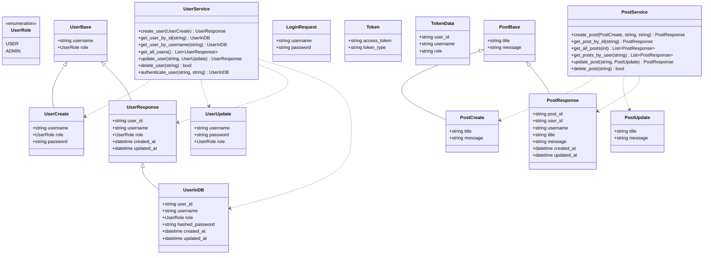
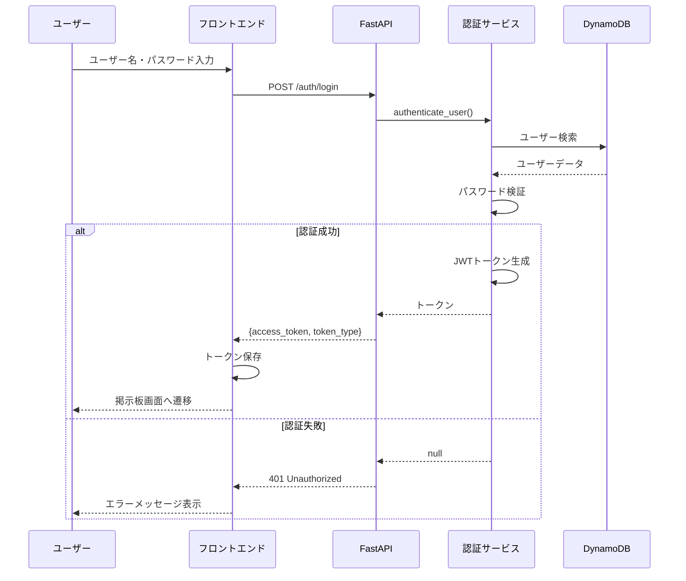
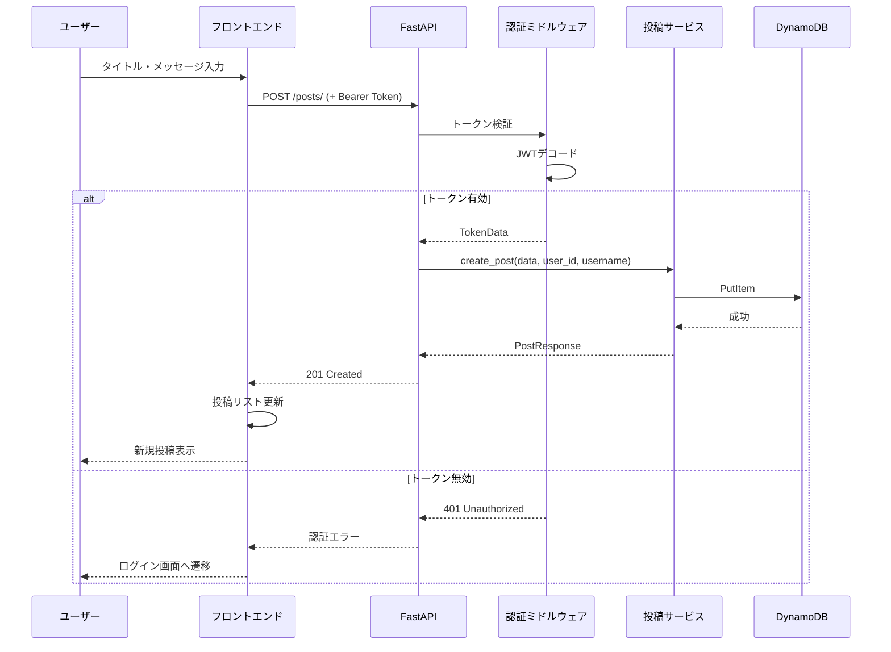
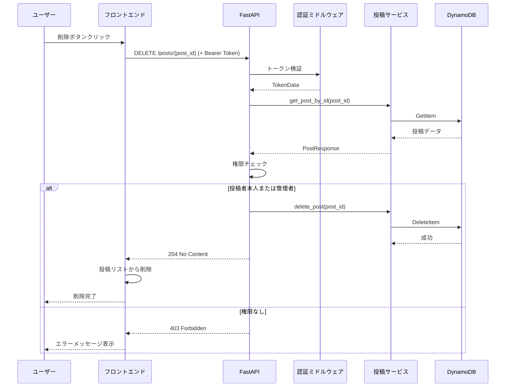
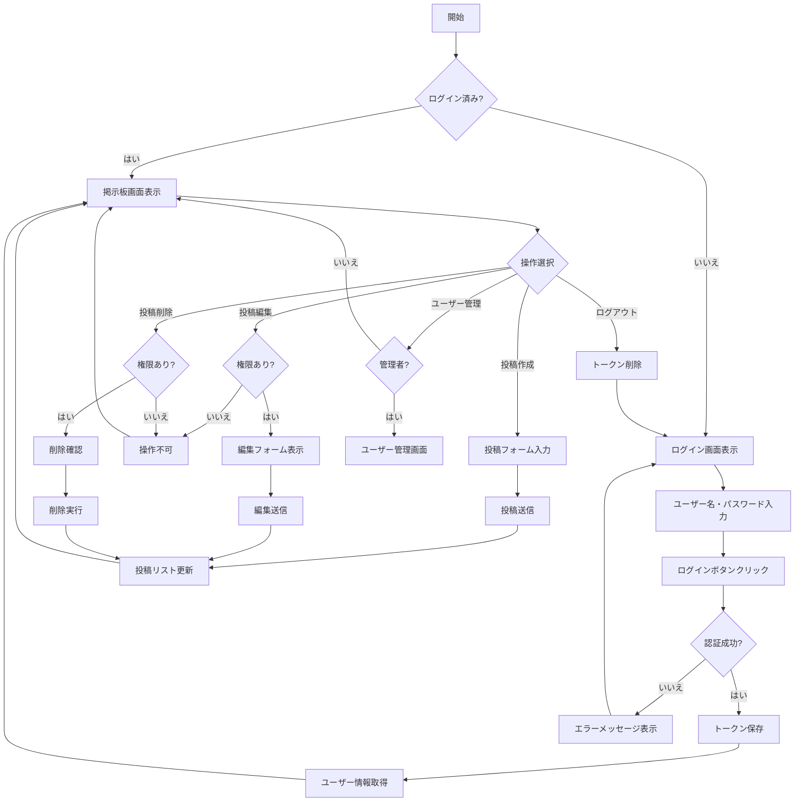
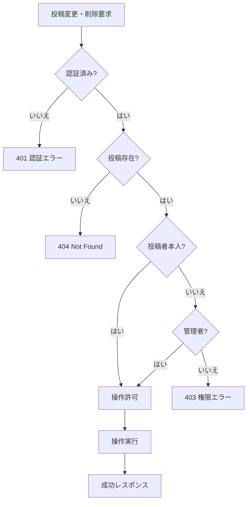
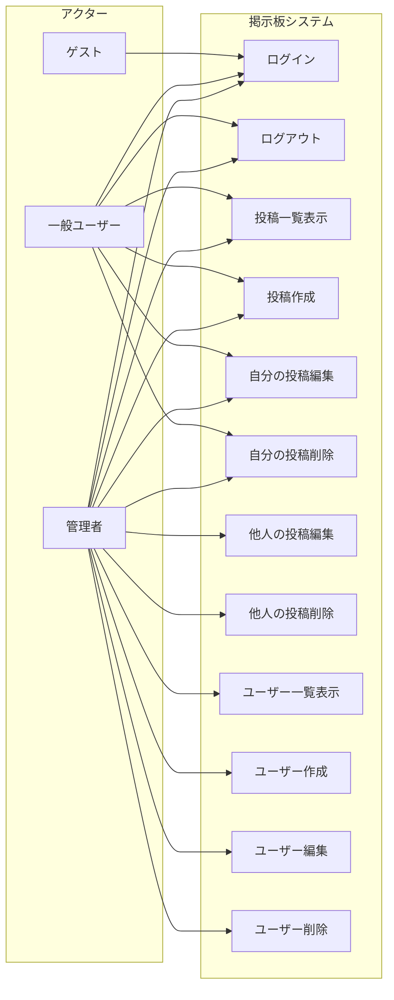

# 掲示板システム ドキュメント

Vue.js + FastAPI + DynamoDBで構築した掲示板システムの設計ドキュメントです。

## 目次

1. [クラス図](#クラス図)
2. [シーケンス図](#シーケンス図)
3. [アクティビティ図](#アクティビティ図)
4. [ユースケース図](#ユースケース図)

---

## クラス図

システムの主要なクラス構造を示します。

---

## シーケンス図

### ログイン処理

### 投稿作成処理

### 投稿削除処理

---

## アクティビティ図

### ユーザー認証フロー

### 投稿変更・削除の権限チェック

---

## ユースケース図

### ユースケース詳細

| ユースケース | アクター | 説明 |
|-------------|---------|------|
| ログイン | ゲスト、一般ユーザー、管理者 | ユーザー名とパスワードで認証を行い、システムにアクセスする |
| ログアウト | 一般ユーザー、管理者 | 認証状態を解除してシステムからログアウトする |
| 投稿一覧表示 | 一般ユーザー、管理者 | 全投稿を新しい順に一覧表示する |
| 投稿作成 | 一般ユーザー、管理者 | 新しい投稿を作成する |
| 自分の投稿編集 | 一般ユーザー、管理者 | 自分が作成した投稿を編集する |
| 自分の投稿削除 | 一般ユーザー、管理者 | 自分が作成した投稿を削除する |
| 他人の投稿編集 | 管理者 | 他のユーザーが作成した投稿を編集する |
| 他人の投稿削除 | 管理者 | 他のユーザーが作成した投稿を削除する |
| ユーザー一覧表示 | 管理者 | 登録されている全ユーザーを一覧表示する |
| ユーザー作成 | 管理者 | 新しいユーザーアカウントを作成する |
| ユーザー編集 | 管理者 | 既存のユーザー情報を編集する |
| ユーザー削除 | 管理者 | ユーザーアカウントを削除する |
